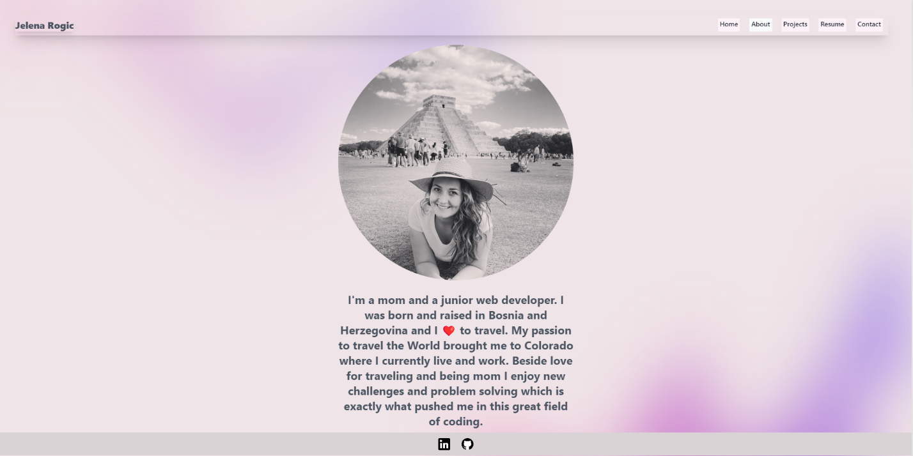

# **Jelena-React-Portfolio**

## *Table of Contents*
 ___
  - [Installation](#description)
  - [Usage](#usage)
  - [Software](#software)
  - [License](#license)
  - [Links](#links)

## *Description*
___
This is my personal portfolio created to allow any of my future colleagues, and employers to get to know me better. Certainly, one of the first steps I am making in order to do what I love and that is coding! This website has four sections. One of them  contains a little information about me, in second section you can see my previous projects, third one is where in future you will be able to download my resume and of course last one is with my contact information.
## *Usage*

 
The following image shows home page:

 
The following image shows About me page:

## *Software*
___
Social-network-api was built/deployed using the following:
- VSCode
- Gitbash/Github
- React
- Tailwind
- Javascript

## *License*
___
This application is covered under the MIT license.
For more information about this license please visit https://opensource.org/licenses/MIT

## *Links*
___
For comments/concerns please contact us at https://github.com/Jelenarog/Jelena-React-Porfolio  
Deployed website

